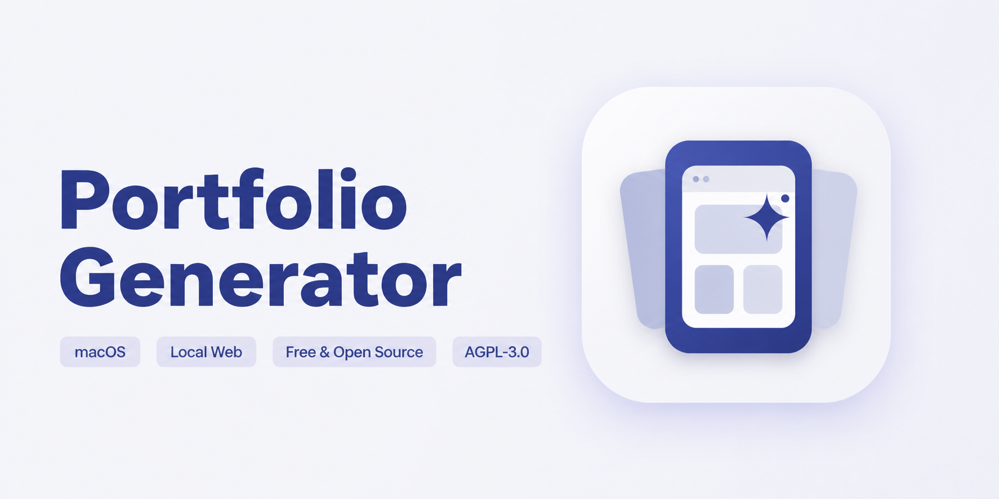
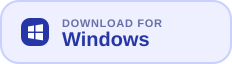
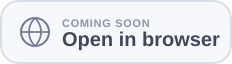
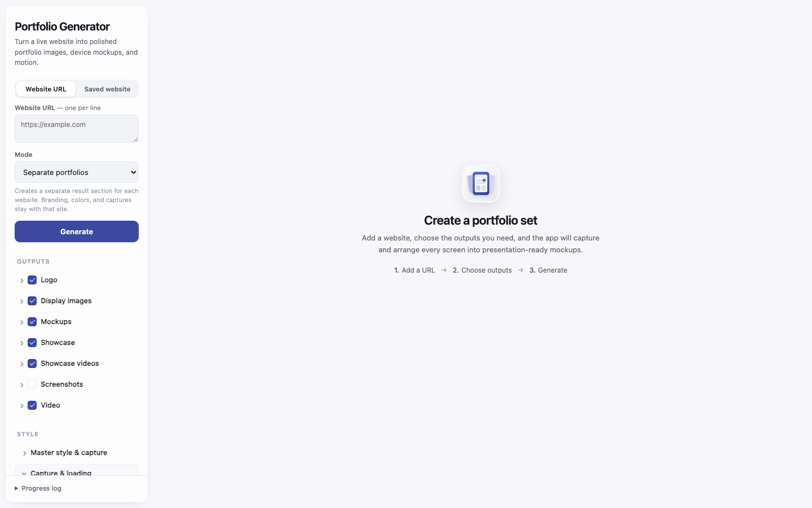
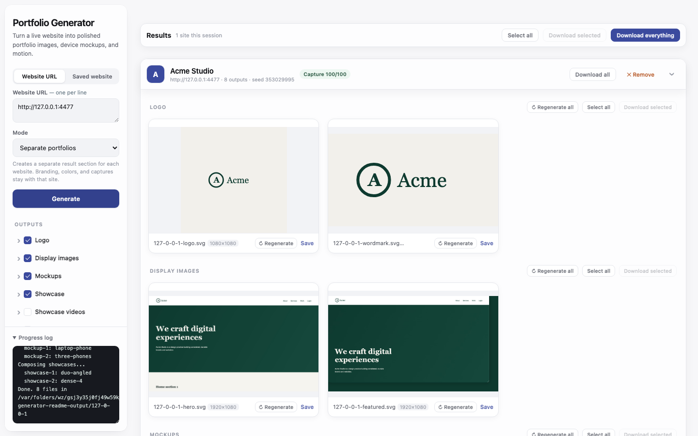

# Portfolio Generator

<p>
  <a href="https://github.com/st-designs/portfolio-generator/releases/latest/download/Portfolio-Generator-macOS-Apple-Silicon.dmg"></a>
  <a href="https://github.com/st-designs/portfolio-generator/releases/latest/download/Portfolio-Generator-Windows-Setup.exe"></a>
  <a href="#web-version"></a>
</p>

Portfolio Generator turns a live or saved website into a polished set of portfolio assets. Give it a URL, ZIP, HTML file, or complete website folder and it will capture the site, check the results, and arrange the strongest screens into ready-to-use mockups, showcases, display images, screenshots, and motion exports.

Everything runs locally. There are no accounts, projects, or cloud storage to manage, and each session stays temporary until you export it.

## What it creates

- Logo tiles and wordmarks
- Hero and featured display images
- Desktop, tablet, and mobile mockups
- Multi-screen showcase compositions
- Animated showcases and scrolling page videos
- Plain or framed viewport and full-page screenshots
- SVG, PNG, JPEG, MP4, GIF, and ZIP exports

## A quick look



The sidebar keeps the common path short while leaving capture behavior, render sizes, section styles, and seeded layouts available when needed.



Results are grouped by website and output type. Individual assets or complete sets can be regenerated, selected, previewed, and exported without rerunning unrelated work.

## Getting started

Portfolio Generator requires Node.js 22.12 or newer.

```bash
git clone https://github.com/st-designs/portfolio-generator.git
cd portfolio-generator
npm run setup
```

`npm run setup` installs the dependencies and downloads the project-local Chromium build used for capture.

### Run the local web app

```bash
npm start
```

The app opens at `http://localhost:3311`. The browser interface has the same generation workflow as the desktop app; exports use the browser's normal download behavior.

### Run the desktop app

```bash
npm run desktop
```

The Electron app adds a native window and save dialog. Release packages can be created with:

```bash
npm run desktop:mac
npm run desktop:win
```

Build release packages on the target operating system. The macOS target produces a DMG and ZIP; the Windows target produces an installer and portable build.

The GitHub release includes separate builds for Apple Silicon and Intel Macs, plus Windows installer and portable packages. Release checksums are published alongside them.

The automated packages are not yet notarized or signed with commercial distribution certificates, so macOS and Windows may show the standard first-run security prompt.

### Use the terminal

```bash
npm run generate -- https://example.com
npm run generate -- https://example.com --seed=42 --pages=/about,/work
```

Terminal output is written to `Generated/` unless `OUTPUT_DIR` or `config.json` points elsewhere. Each website has its own folder, with assets grouped into `SVG`, `PNG`, `JPG`, `MP4`, `WEBM`, and `GIF` subfolders as applicable.

## How capture works

Playwright renders desktop, tablet, and mobile frames at high density. Before saving a frame, the capture engine waits for fonts, images, backgrounds, lazy content, animations, and page-height stability. It can remove common cookie notices, modal layers, newsletter prompts, and chat launchers, and it uses stitched capture for long or scroll-sensitive pages when needed.

Multiple stable-shot candidates are scored for detail, edges, blank regions, and overall usability. The strongest usable result wins, while one broken page is skipped without discarding successful pages from the same run.

Compositions are produced as editable SVG with high-quality embedded image detail. A layout seed makes an arrangement reproducible; changing the seed creates a different composition from the same verified capture pool.

## Saved websites

The app accepts `.zip`, `.html`, and `.htm` files, plus complete website folders. Folder imports are packed in the browser so their relative paths stay intact. Imported files are extracted into a temporary directory, served from an isolated localhost origin, and removed when the app closes.

A saved site may still depend on remote fonts, images, or scripts. Those assets need an internet connection unless they were included in the archive.

## Configuration

Set `outputDir` in `config.json`, or leave it blank to use the local `Generated/` folder.

| Environment variable | Purpose |
| --- | --- |
| `PORT` | Local web app port; defaults to `3311` |
| `OUTPUT_DIR` | Generated asset directory |
| `MAX_PAGES` | Maximum desktop pages captured per site |
| `MAX_MOBILE` | Maximum mobile pages captured per site |
| `MAX_TABLET` | Maximum tablet pages captured per site |
| `NETIDLE_MS` | Network-idle wait budget |

## Checks

```bash
npm run check
```

The check command parses every JavaScript file, the inline browser script, and the project JSON files, then runs the capture, archive-safety, composition, input-bounds, and server tests.

README screenshots can be reproduced from the bundled fixture with:

```bash
npm run docs:screenshots
```

## Web version

Portfolio Generator is a local tool. A public hosted version needs a proper job queue, rate limiting, URL-fetch protections, and an output cleanup policy before it should be exposed to the internet. Authenticated websites are also outside the current capture flow unless they can be supplied as a saved site.

The browser-hosted version is coming soon. For now, `npm start` runs the complete browser interface locally.

Planned work and the reasoning behind it live in [docs/ROADMAP.md](docs/ROADMAP.md).

## License

Copyright © 2026 ST Designs. Portfolio Generator is free and open-source software licensed under the [GNU Affero General Public License v3.0 only](LICENSE).

You may use, study, modify, and redistribute the project under the AGPL terms. Modified versions offered to users over a network must also offer those users the corresponding source code. Copyright ownership remains with ST Designs and the respective contributors.
